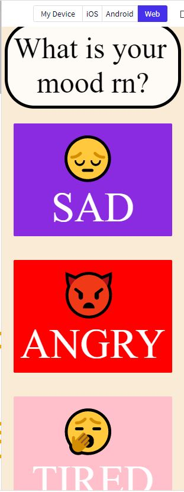

The first page displays this screen, with these three buttons.

Upon clicking on one of the buttons, the app takes the user to a page with a cat picture to assist them with their specific mood.
I have added the cat pictures in this repository.
